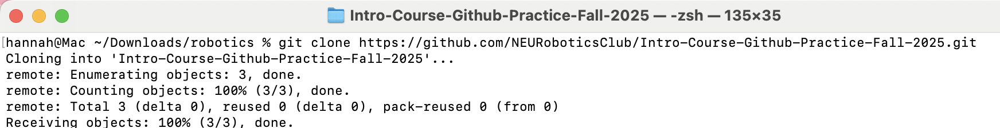
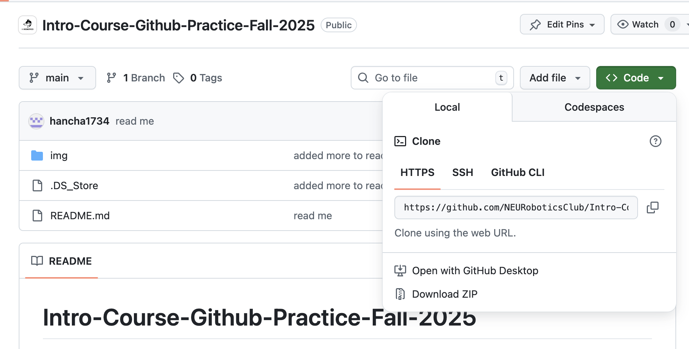

# Intro-Course-Github-Practice-Fall-2025
Welcome to the NURobotics Intro to Robotics Course's practice repository! We'll be using this repo as practice to get familiar with git and GitHub. The following is a step-by-step instructional guide for making your first commit and push!

# Purpose of a README file
## AKA what even is this file you're reading right now?
It introduces and explains a project. Typically it's the first file you create in a project.

Today's instructions will be in this(README) file.

For more info: https://www.makeareadme.com/

# Tutorial
## Overview
We've provided a txt file with a template of some info for you to fill out. In this tutorial, we'll be duplicating the template, renaming the file, filling it out, and eventually merging it with the main branch.

## Git and GitHub
What's the difference between these things? What even is "git"?

Well, let's start with git. Git is a version control system (VCS). It's a way to track changes in code and is a key asset when working on a codebase with several developers. Think of it like the version history feature in Google Docs. You can see what the file looked like at different timestamps, see who made what changes, and even revert to old versions and restore changes.

GitHub, on the other hand, is a service that hosts git repositories. There are other repository-hosting services like GitLab and Bitbucket, but GitHub is the most popular and is what we'll use.

Check out this post to learn more about the differences: https://blog.hubspot.com/website/git-vs-github.

TDLR - Git is the software that actually tracks code changes within a repository, and GitHub hosts these repositories via a web interface.

## Accessing the repository
What is a repository? GitHub docs define it as:
> A repository contains all of your project's files and each file's revision history. You can discuss and manage your project's work within the repository.

Well, the first step in this tutorial was to access the repository on GitHub. If you're reading this now, chances are you're here! If not, go to https://github.com/NEURoboticsClub/Intro-Course-Github-Practice-Fall-2025.

## Opening the Command Line
### On a Windows
>Click: the Start button or press the Windows key on your keyboard.
>Type: cmd or Command Prompt into the search bar.
>Select: "Command Prompt" from the search results to open it.

### On a Mac
>Open Spotlight: Press the Command (⌘) key + Spacebar. 
>Type "Terminal": In the search bar that appears, type Terminal. 
>Launch Terminal: Press Enter or double-click on the Terminal application from the search results.

## Cloning a Remote Repository
### What is a remote repository?
A remote URL is Git's fancy way of saying "the place where your code is stored." That URL could be your repository on GitHub, or another user's fork, or even on a completely different server.

You can only push to two types of URL addresses:
For an HTTPS URL:
`https://github.com/user/repo.git`

For an SSH URL:
`git@github.com:user/repo.git`

Git associates a remote URL with a name, and your default remote is usually called `origin`.

### Cloning *this* repo
In your command line type `ssh https://github.com/NEURoboticsClub/Intro-Course-Github-Practice-Fall-2025.git'

You can find the link by clicking the green `code` button and then copying the HTTPS URL.

